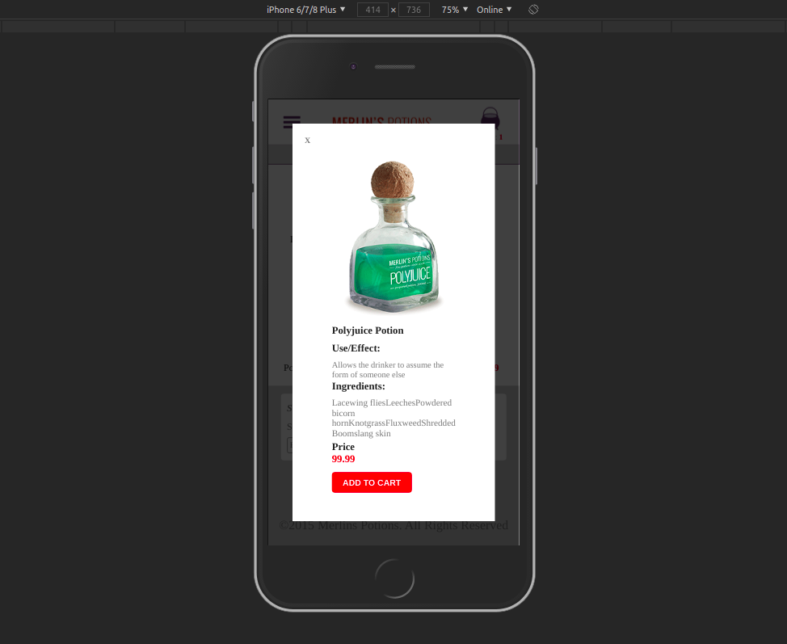

<h1 align="center">
    
</h1>

<h4 align="center"> 
	:heavy_check_mark: 🚀 Frontend da homepage do site Merlin's Potions :heavy_check_mark:
</h4>

<p align="center">
  <a href="#-project">Project</a>&nbsp;&nbsp;&nbsp;|&nbsp;&nbsp;&nbsp;
  <a href="#rocket-Technologies">Technologies</a>&nbsp;&nbsp;&nbsp;|&nbsp;&nbsp;&nbsp;
  <a href="#-layout">Layout</a>&nbsp;&nbsp;&nbsp;|&nbsp;&nbsp;&nbsp;
  <a href="#-how-to-use">How to use</a>&nbsp;&nbsp;&nbsp;|&nbsp;&nbsp;&nbsp;
  <a href="#-how-to-contribute">How to contribute</a>&nbsp;&nbsp;&nbsp;|&nbsp;&nbsp;&nbsp;
  <a href="#memo-license">License</a>
</p>

## 💻 Project

<p>In this challenge, he will develop a new application, GoMarketplace. This time it's time for you to practice what you've learned so far in React Native, along with TypeScript, using routes, Async Storage and the Context API.</p>

<h3>Lautout Responsivo no Iphone 6/7/8/Plus</h3>
<p align="center">    
  
  
</p>
<p align="center">  
  
  
</p>
<p align="center">  
  
  
</p>
<p align="center"> 
    
 </p>
 
 <h3>Lautout Responsivo no Ipad</h3>
<p align="center">      
  
  
</p>
<p align="center">  
  
    
</p>

## :rocket: Technologies

This project was developed with the following technologies:

- [ReactNative](https://reactnative.dev/) 
- [Typescript](https://www.typescriptlang.org/docs/home.html)

## :information_source: How To Use

To clone and run this application, you'll need [Git](https://git-scm.com), [ReactNative][reactnative] + [Yarn][yarn] installed on your computer.

From your command line:

### Install API
```bash
# Clone this repository
$ git clone https://github.com/ApoOliveira18/desafio-fundamentos-react-native.git
# Go into the repository
$ cd desafio-fundamentos-react-native/

# Install dependencies for directories
$yarn

# Run tests
$ yarn test
```

## 🤔 How to contribute

- Make a fork;
- Create a branck with your feature: `git checkout -b my-feature`;
- Commit changes: `git commit -m 'feat: My new feature'`;
- Make a push to your branch: `git push origin my-feature`.

After merging your receipt request to done, you can delete a branch from yours.

## :memo: License

This project is under the MIT license. See the [LICENSE](LICENSE.md) for details.

---

Feito com ♥ && 🎧 && 😊 || 😥 
 por Adilson Oliveira :wave: [Get in touch!] www.linkedin.com/in/adilson-p-oliveira

[nodejs]: https://nodejs.org/
[yarn]: https://yarnpkg.com/
[vc]: https://code.visualstudio.com/
[vceditconfig]: https://marketplace.visualstudio.com/items?itemName=EditorConfig.EditorConfig
[vceslint]: https://marketplace.visualstudio.com/items?itemName=dbaeumer.vscode-eslint
[prettier]: https://marketplace.visualstudio.com/items?itemName=esbenp.prettier-vscode
[reactnative]: https://reactnative.dev/
[typescript]: https://www.typescriptlang.org/docs/home.html


